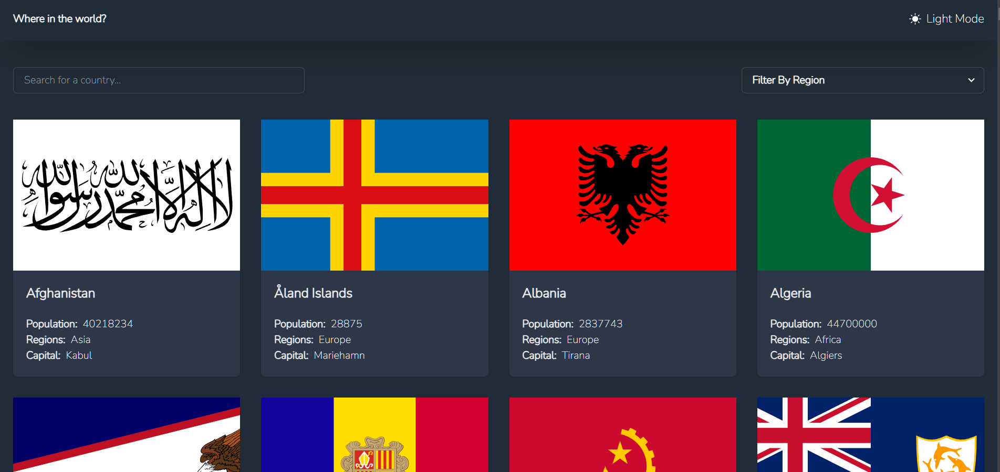

# REST Countries API with color theme switcher

## Welcome! 👋

Thanks for checking out.
[Demo App](https://country-details-eight.vercel.app/)

## The challenge

The challenge is to integrate with the [REST Countries API](https://restcountries.com) to pull country data and display it like in the designs.

## Technologies Used

- React
- Chakra UI
- TypeScript
- React Router
- React Hooks
- JSON Data
- Vercel

## Features:

- See all countries from the API on the homepage
- Search for a country using an `input` field
- Filter countries by region
- Click on a country to see more detailed information on a separate page
- Click through to the border countries on the detail page
- Toggle the color scheme between light and dark mode *(optional)*

**⚠️ NOTE ⚠️: Sometimes the REST Countries API can go down. I've added a `data.json` file with all the country data if you prefer to use that instead. However, please be aware that the data in the JSON file might not be up-to-date.**

## Building your project

Feel free to use any workflow that you feel comfortable with. Below is a suggested process, but do not feel like you need to follow these steps:

1. Initialize your project as a public repository on [GitHub](https://github.com/kerrybli/country-details). Creating a repo will make it easier to share your code with the community if you need help. If you're not sure how to do this, [have a read-through of this Try Git resource](https://try.github.io/).
2. Configure your repository to publish your code to a web address. This will also be useful if you need some help during a challenge as you can share the URL for your project with your repo URL. There are a number of ways to do this, and we provide some recommendations below.
3. Look through the designs to start planning out how you'll tackle the project. This step is crucial to help you think ahead for CSS classes to create reusable styles.
4. Before adding any styles, structure your content with HTML. Writing your HTML first can help focus your attention on creating well-structured content.
5. Write out the base styles for your project, including general content styles, such as `font-family` and `font-size`.
6. Start adding styles to the top of the page and work down. Only move on to the next section once you're happy you've completed the area you're working on.

## Getting Started

To run the Countries App locally, follow these steps:

1. Clone the repository:
2. Navigate to the project directory:
3. Install the dependencies: <code>npm i </code>
4. Start the development server: `npm start`
5. Open your browser and visit `http://localhost:3000` to access the app.

## Contributing

Contributions are welcome! If you'd like to contribute to the project, please follow these steps:

1. Fork the repository.
2. Create a new branch for your feature or bug fix.
3. Make your changes and commit them.
4. Push your changes to your fork.
5. Submit a pull request.

**Have fun building!** 🚀
